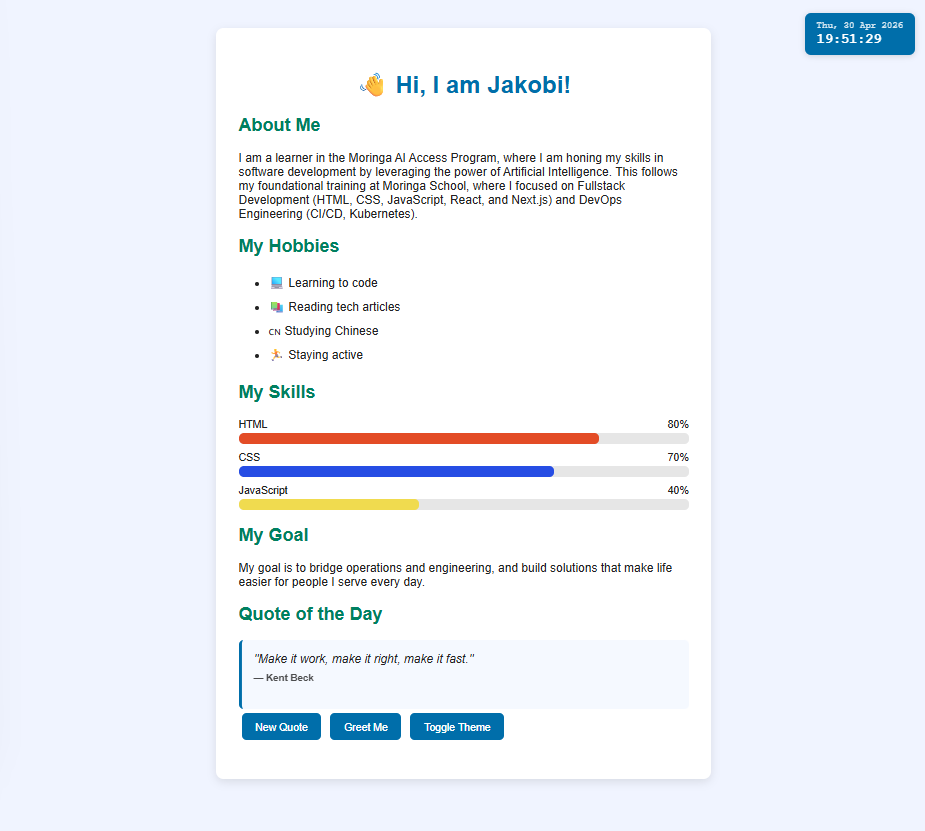
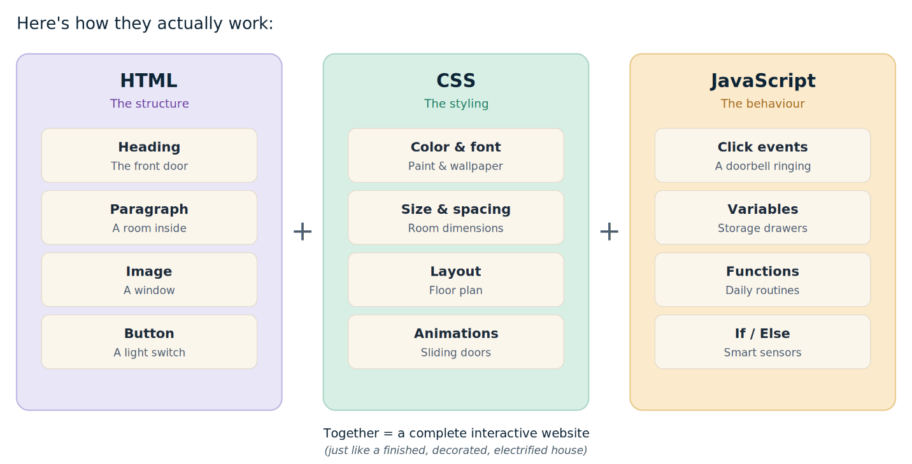
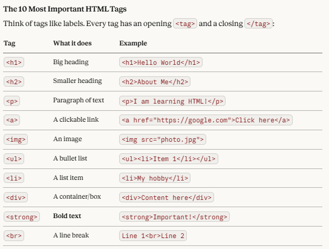
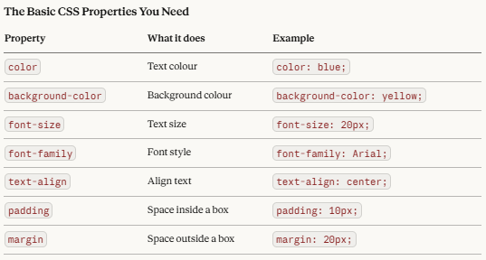
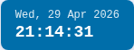
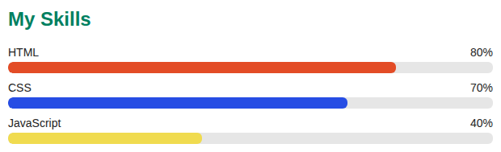
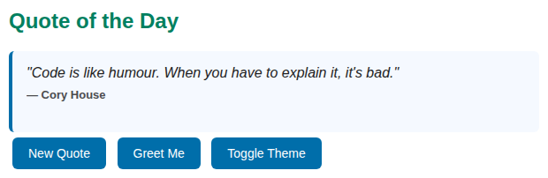
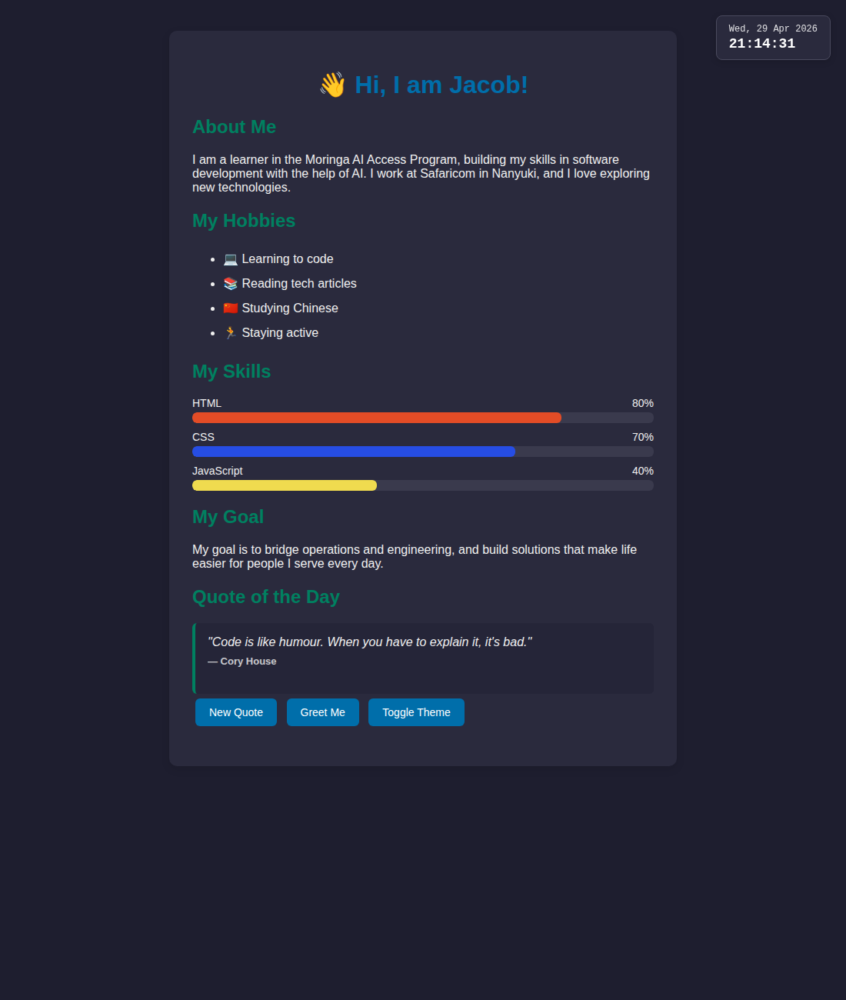
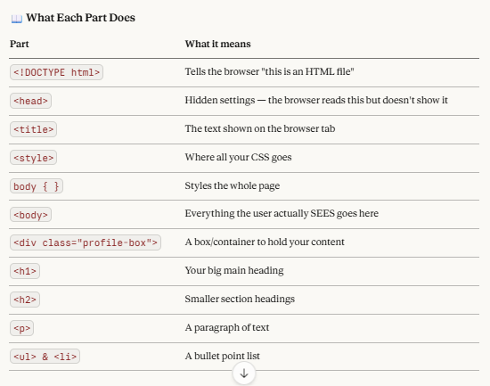
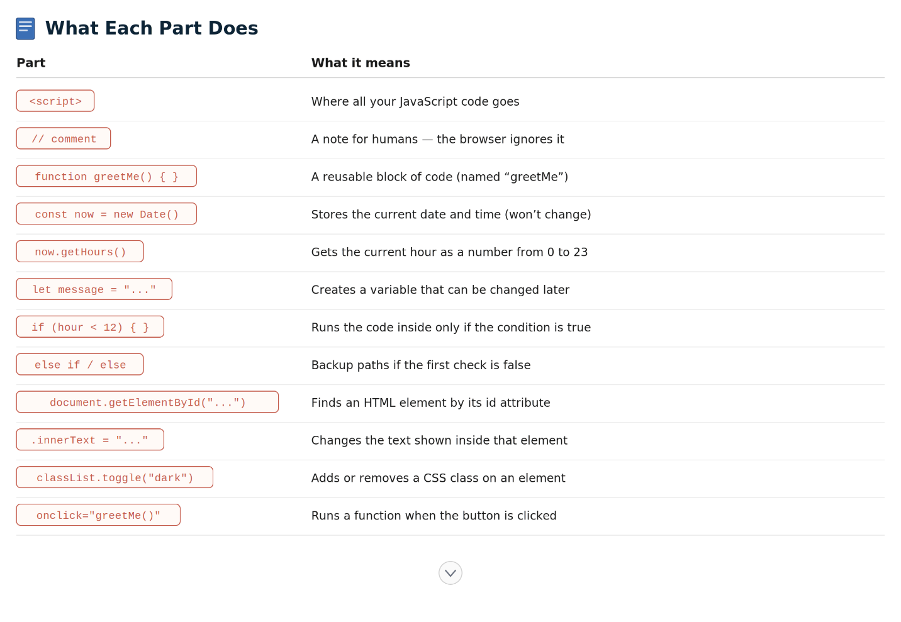

# Capstone Project — Beginner's Toolkit: HTML, CSS & JavaScript using AI

**By:** Jacob Taraya

**Live demo:** [https://jtaraya.github.io/my-profile-page/](https://jtaraya.github.io/my-profile-page/)

This is a beginner-friendly toolkit that helps anyone get started with HTML, CSS, and JavaScript using AI as a learning partner. It is the capstone project for the.



---

## Section 1 — Tool's Objective

HTML (HyperText Markup Language), CSS (Cascading Style Sheets), and JavaScript are the three core technologies used to build modern websites.

HTML, CSS, and JavaScript are the building blocks of the web. I chose them because I want to learn the foundations of frontend development from scratch. My intention is to build a simple, interactive webpage with AI guiding and teaching me along the way.

HTML provides the structure and content of a webpage — like headings, paragraphs, images, and lists. CSS controls how everything looks — colours, fonts, layout, and spacing. JavaScript adds behaviour — buttons that respond to clicks, content that updates, and pages that feel alive. Together, they are the foundation of every website on the internet.

**Why is it useful?** As a beginner in frontend development, HTML, CSS, and JavaScript are the perfect starting point. They require no installation, run in any browser, and teach you how the web actually works — from static pages all the way to interactive apps.

---

## Step 1 — HTML, CSS & JavaScript Learning with AI

**Prompt 1 — Understand what they are:**
> *"I am a complete beginner. Can you explain what HTML, CSS, and JavaScript are, how they work together, and why they are important for building websites? Use simple language and give me a real-world analogy."*

**Prompt 2 — Learn HTML basics:**
> *"Can you teach me the 10 most important HTML tags a beginner needs to know? For each one, show me an example and explain what it does in plain English."*

**Prompt 3 — Learn CSS basics:**
> *"Now teach me the basics of CSS. How do I change colours, fonts, and layout on a webpage? Show me simple examples I can try."*

**Prompt 4 — Learn JavaScript basics:**
> *"Now teach me the very basics of JavaScript. What are variables, functions, and events? Show me how to make a button do something when I click it. Keep it simple — I have never written code before."*

### What are HTML, CSS, and JavaScript?

Think of building a smart house 🏠:

- **HTML is the structure** — the walls, roof, doors, and windows
- **CSS is the decoration** — the paint, curtains, and furniture
- **JavaScript is the electricity** — it powers the lights, opens the garage when you click a remote, and makes things actually do stuff

**HTML** stands for **HyperText Markup Language**. It tells the browser *what* to show on a page — headings, paragraphs, images, buttons, links, etc.

**CSS** stands for **Cascading Style Sheets**. It tells the browser *how* things should look — colours, sizes, fonts, spacing, etc.

**JavaScript** (often shortened to **JS**) tells the browser *what should happen* — when a user clicks a button, fills in a form, or scrolls down the page.

Without HTML, there's no content. Without CSS, everything looks plain. Without JavaScript, the page just sits there. **Together, they make every modern website you've ever visited.**

### Here's how they actually work



### The 10 most important HTML tags



### The basic CSS properties you need



---

## Section 2 — Quick Summary

- HTML uses **tags** like `<h1>`, `<p>`, and `<ul>` to structure content on a page
- CSS is written inside `<style>` tags and uses **properties** like `color`, `font-size`, and `padding`
- JavaScript is written inside `<script>` tags and uses **functions** and **events** (like `onclick`) to make pages interactive
- Every HTML file starts with `<!DOCTYPE html>` to tell the browser what kind of file it is
- A `<div>` is a container that helps you **group and style** sections of a page
- I learned that JavaScript can read and change anything on the page using `document.getElementById(...)` and `.innerText`
- `setInterval()` makes a function run on a timer — the foundation for any "live" feature like a clock
- CSS `transition` and JavaScript work together to create smooth animations
- `Math.random()` plus `Math.floor()` lets you pick a random item from an array
- Saving the file and refreshing the browser instantly shows my changes — no special tools needed

---

## Section 3 — System Requirements

To use HTML, CSS, and JavaScript you need:

- ✅ A computer (Windows, Mac, or Linux)
- ✅ A text editor (Notepad on Windows, or VS Code for a better experience)
- ✅ A web browser (Chrome, Firefox, or Edge)
- ✅ No internet connection required to build and test locally
- ✅ No installation or setup needed — HTML, CSS, and JavaScript all run inside the browser out of the box!

---

## Step 2 — Build Something with AI

**Prompt 5:**
> *"Help me build a simple personal profile webpage using HTML, CSS, and JavaScript. I want it to have: my name as a heading, a short paragraph about me, a list of my hobbies, and two buttons — one that greets me with the current time of day, and one that toggles between a light and dark theme. Walk me through it step by step."*

After the basic page worked, I added three more interactive features to make it feel like a real website:

**Prompt 6 — Live clock:**
> *"How do I make a clock that updates every second on my webpage? Show me the simplest way using `setInterval`, and put it in the top-right corner."*

**Prompt 7 — Animated skill bars:**
> *"How do I make progress bars that animate from 0% to a target value when the page loads? I want HTML at 80%, CSS at 70%, and JavaScript at 40%. Use both CSS and JavaScript."*

**Prompt 8 — Quote of the day:**
> *"How do I store a list of quotes in JavaScript and pick a random one when a button is clicked? Use an array and `Math.random()`."*

---

## Section 4 — Installation & First Steps

**How to create your first HTML file:**

1. Open Notepad (Windows) or any text editor
2. Type or paste your HTML, CSS, and JavaScript code
3. Click **File → Save As**
4. Name your file `index.html` (make sure it ends in `.html`, not `.txt`)
5. Save it to your Desktop
6. Double-click the file — it will open in your browser automatically
7. Every time you make changes, save the file and refresh the browser to see updates
8. To check your JavaScript, press **F12** in the browser to open Developer Tools — the **Console** tab will show any errors

---

## Section 5 — Related Working Example

This is my interactive personal profile webpage built during this project using HTML for structure, CSS for styling, and JavaScript for interactivity. It includes a heading, an about-me section, a hobbies list, animated skill bars, a goal statement, a quote of the day, and three interactive buttons — one that displays a time-aware greeting, one that toggles between light and dark themes, and one that shuffles to a new quote. There's also a live clock pinned to the top-right corner.

### Feature 1 — Live Clock

A clock that updates every second, pinned to the top-right corner of the page. It adapts to the current theme and shows the date in a friendly format.



```javascript
function updateClock() {
  const now = new Date();
  const dateString = now.toLocaleDateString("en-GB", {
    weekday: "short", day: "numeric", month: "short", year: "numeric"
  });
  const timeString = now.toLocaleTimeString("en-GB", { hour12: false });
  document.getElementById("clock-date").innerText = dateString;
  document.getElementById("clock-time").innerText = timeString;
}
updateClock();                       // run once immediately
setInterval(updateClock, 1000);      // then every second forever
```

### Feature 2 — Animated Skill Bars

Three progress bars that fill up smoothly when the page loads, showing my proficiency in each language.



The animation is a team effort: CSS handles *how* the bar moves, JavaScript handles *when* it moves.

```css
.skill-fill {
  width: 0;                              /* starts empty */
  transition: width 1.5s ease-out;       /* CSS animates the change */
}
```

```javascript
function animateSkillBars() {
  const bars = document.querySelectorAll(".skill-fill");
  bars.forEach(function (bar) {
    const level = bar.getAttribute("data-level");
    setTimeout(function () {
      bar.style.width = level + "%";     // JS triggers the animation
    }, 200);
  });
}
window.addEventListener("load", animateSkillBars);
```

### Feature 3 — Quote of the Day

A random programming quote that shows on page load, with a button to shuffle to a new one.



```javascript
const quotes = [
  { text: "First, solve the problem. Then, write the code.", author: "John Johnson" },
  { text: "Talk is cheap. Show me the code.", author: "Linus Torvalds" },
  // ... more quotes
];

function showRandomQuote() {
  const i = Math.floor(Math.random() * quotes.length);
  const chosen = quotes[i];
  document.getElementById("quote-text").innerText = '"' + chosen.text + '"';
  document.getElementById("quote-author").innerText = "— " + chosen.author;
}
window.addEventListener("load", showRandomQuote);
```

### Dark Mode

Click the **Toggle Theme** button to switch the entire page (including the clock and quote box) into dark mode.



### Full Code

The complete `index.html` file (with all features combined) is in this repository. View it directly: [`index.html`](index.html).

### What each part of the HTML does



### What each part of the JavaScript does



---

## Section 6 — AI Prompt Journal

| Prompt I Used | What I Learned |
|---|---|
| *"Explain what HTML, CSS, and JavaScript are using a simple analogy"* | HTML is the structure of a house, CSS is the decoration, and JavaScript is the electricity that makes things work |
| *"Teach me the 10 most important HTML tags"* | Tags like `<p>`, `<h1>`, `<ul>`, `<div>`, and `<button>` are the building blocks of content |
| *"Teach me the very basics of JavaScript and how to make a button do something on click"* | How to write a function and connect it to an HTML element using `onclick` — that's how interactivity starts |
| *"Help me build a personal profile webpage with a greet button and a theme toggle, step by step"* | How HTML, CSS, and JavaScript fit together in a single file to create something interactive |
| *"My theme toggle isn't working — what is wrong with this code?"* | How to use the browser's Developer Tools (F12) and the Console to find and fix JavaScript errors |
| *"How do I make a clock that updates every second on my webpage?"* | `setInterval(fn, 1000)` runs a function every 1 second forever — the foundation for any "live" feature |
| *"How do I make a progress bar that animates from 0% to its target value when the page loads?"* | CSS `transition` handles the animation, JavaScript just changes the width — they work as a team |
| *"How do I pick a random item from a list in JavaScript?"* | `Math.floor(Math.random() * array.length)` gives a valid random index every time |
| *"How do I make a small box stay in the top-right corner even when the page scrolls?"* | `position: fixed` keeps an element in place; `z-index` controls what shows on top |

---

## Section 7 — Common Gotchas & Fixes

These are mistakes I made or things that confused me:

### Earlier gotchas (HTML & CSS basics)

- ❌ **Forgetting to close a tag** — e.g. writing `<h1>Hello` without `</h1>` breaks the layout. Always close your tags!
- ❌ **Saving as `.txt` instead of `.html`** — the file won't open as a webpage. Always check the file extension when saving.
- ❌ **CSS not working** — I forgot to put CSS inside `<style>` tags. The code must be in the right place.
- ❌ **JavaScript not running** — I forgot to put my code inside `<script>` tags. Without them, the browser ignores the code completely.
- ❌ **Button does nothing on click** — I had spelled the function name differently in `onclick="..."` and in the function definition. JavaScript is case-sensitive!
- ❌ **Using `=` instead of `===`** — a single `=` assigns a value, while `===` checks if two things are equal. Mixing them up causes silent bugs.

### New gotchas (live clock, skill bars, quotes)

- ❌ **Clock showed `--:--:--` for the first second** — `setInterval` waits the full delay before running for the first time. **Fix:** call `updateClock()` once *before* the `setInterval`, so the clock paints instantly.
- ❌ **Skill bars appeared instantly with no animation** — CSS `transition` only animates *changes* in value. If the bar starts at 80% and stays at 80%, there's nothing for the browser to animate. **Fix:** start the bars at `width: 0` in CSS, then have JavaScript change them to their target values *after* the page loads (with a tiny `setTimeout` delay).
- ❌ **`Math.random()` alone gave decimals like `0.347`** — that's not a valid array index. **Fix:** wrap it in `Math.floor(Math.random() * array.length)` to get a whole number between 0 and the last index.
- ❌ **Live clock disappeared on small screens** — `position: fixed` works, but on narrow phones the clock can overlap content. **Fix:** test on different screen sizes; consider adjusting `top` and `right` values for mobile.
- ✅ **Fix:** When something goes wrong, I press **F12** in the browser to open Developer Tools, check the Console for errors, and paste my code into Claude with the question *"what is wrong with this code?"* — it always explains the problem clearly.

---

## Section 8 — References

- 📘 **MDN Web Docs** (best beginner resource): [https://developer.mozilla.org](https://developer.mozilla.org)
- 🎓 **W3Schools HTML Tutorial:** [https://www.w3schools.com/html](https://www.w3schools.com/html)
- 🎓 **W3Schools JavaScript Tutorial:** [https://www.w3schools.com/js](https://www.w3schools.com/js)
- 📖 **MDN — `setInterval`:** [https://developer.mozilla.org/en-US/docs/Web/API/setInterval](https://developer.mozilla.org/en-US/docs/Web/API/setInterval)
- 📖 **MDN — `Math.random`:** [https://developer.mozilla.org/en-US/docs/Web/JavaScript/Reference/Global_Objects/Math/random](https://developer.mozilla.org/en-US/docs/Web/JavaScript/Reference/Global_Objects/Math/random)
- 🤖 **Claude AI** (used in this project): [https://claude.ai](https://claude.ai)
- 📂 **My project code:** [github.com/jtaraya/my-profile-page](https://github.com/jtaraya/my-profile-page)

---

*Built with curiosity and the help of AI. — Jacob Taraya*
